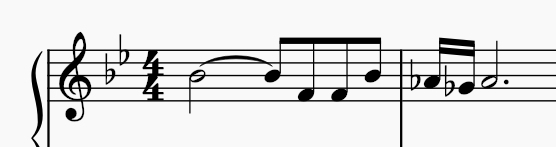

# 1986 Intro Main

This one begins with the same idea of the [Main1](/motifs/1986-Main1.md) motif, the leap down a fourth. But instead of stopping, the F is repeated, followed by the leap up a fourth to Bb. It is followed by the new idea, a trill of the Ab and Gb. The use of b7 and b6 is a key feature of the main theme which shows up here.