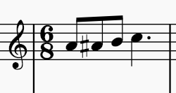

# 1986 Item Get

A simple chromatic ascending four note line. An instant classic which will be reused in numerous ways throughtout the series. In its original use, three lines play this chromatic line, starting in F C and A in this order from the bass to the soprano. Basically a major chord that goes chromatically up a minor third.